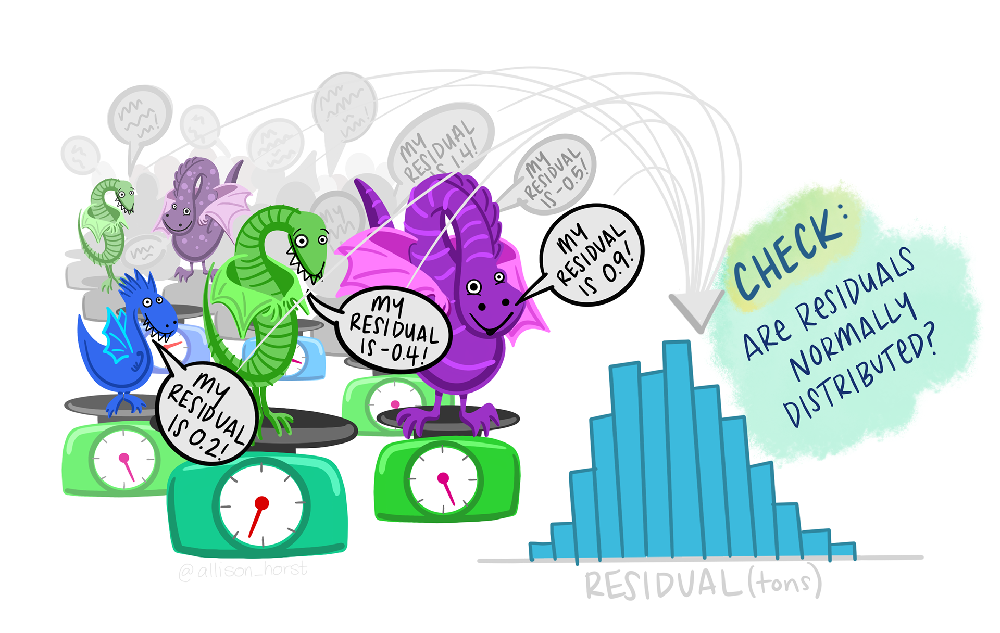

```{r housekeeping}
#| include: false

# All done in script
```

# Introduction

::: {.callout-note title="Learning objectives"}
As a reminder, the learning objectives for this week are:

1.  Explain the key assumptions and limitations of linear regression
2.  Outline when and why quantile regression is preferred
3.  Describe how asymmetric loss functions weight over- and under-prediction at different points of the outcome distribution
4.  Fit and interpret quantile regression models using the *quantreg* package in R
5.  Visualise and communicate the results of quantile regression effectively
:::

This week we've learned about a semi-parametric alternative to linear regression that does not assume normally distributed errors. We've also seen how the quantile approach can be extended to ask more nuanced questions about the data: moving beyond "Does X have a relationship with Y?" to "How does the relationship between X and Y vary?". Today we'll put this into practice by first modelling heterogeneity in household finances using the built-in `engel` dataset, and then by applying this knowledge to a dataset of children's language and literacy skills.

# Setting up

## Packages

Today's practical will use the following packages. You will need to install each one, before loading them at the top of your script.

```{r libraries}
#| warning: false
#| output: false

# Load packages
library(tidyverse)
library(quantreg)
library(performance)

# Turn off scientific notation
options(scipen = 999)
```

------------------------------------------------------------------------

# Part A: Core example

## Introduction to the dataset

We will start today with one of the commonly used training datasets built into the *quantreg* package, the *Engel* dataset. Ernst Engel was a 19th century German statistician, known for his economic work on living standards. *Engel's law* states that as family income increases, the proportion of that budget that is spent on food decreases—making proportion of outgoings used for food a good indicator of living standards. Engel based these observations on budget surveys for Belgian working class households, and this dataset was reanalysed by [Koenker and Bassett (1982)](https://doi.org/10.2307/1912528) in developing quantile regression methods.

Load the dataset into your R environment as follows.

```{r load-dat1}
#| output: false

# Import data into environment
data(engel)

```

Complete the following tasks in R to explore the dataset:

-   Inspect the mean, median, and range of the two variables
-   Plot the distribution of each variable (e.g., via a histogram or density plot) - do they look normally distributed, or skewed?
-   Use `ggplot2` to create a scatterplot, with `income` on the X-axis and `foodexp` on the Y-axis. Store this as an R object, `engel_base`, ready to add our regression lines shortly!

```{r engel-desc}
#| code-fold: true
#| code-summary: "Show example code"
#| eval: false 

# Many options for summary statistics, e.g., 
summary(engel)
#... this gets the necessary information efficiently, but it isn't very beautiful! Feel free to use tidyverse code, individual functions, or find a bespoke package that does this nicely.  

# Distribution
hist(engel$income)
hist(engel$foodexp)

# Plot
engel_base <- ggplot(engel, aes(income, foodexp)) + 
  geom_point() + 
  theme_classic()
engel_base
```

```{r engel-plot}
#| echo: false

# Plot
engel_base <- ggplot(engel, aes(income, foodexp)) + 
  geom_point() + 
  theme_classic()

```

## Fit a linear model 

Let's start by fitting a regular linear regression model, as you saw how to do [last semester](https://3mmarand.github.io/R4BABS/pgt52m/week-6/overview.html).

```{r engel-lm}
#| output: false 

# Fit model
engel_lm <- lm(foodexp ~ income, data = engel)

# Print output
summary(engel_lm)
```

Check the assumptions, including the normality of residuals and homogeneity of variance. You can do this using the tools you learned about last semester, and/or using the `check_model()` functions we used last week. Is this a good model for the data?

[{fig-alt="A hoard of multiple different dragons stand on scales, shouting out their residuals based on the model estimates (e.g. \"My residual is 0.2 tons! My residual is -0.4 tons! My residual is 0.9 tons!\" A histogram to the right shows the distribution of these residuals, with text \"Check: are residuals normally distributed?\"" fig-align="center"}](https://x.com/allison_horst)

```{r engel-lm-assump}
#| code-fold: true
#| code-summary: "Show example code"
#| eval: false

# Specific tools
plot(engel_lm, which = 1)
hist(engel_lm$residuals)
shapiro.test(engel_lm$residuals)

# Helpful wrapper
check_model(engel_lm)

```

Let's add the model regression line to the `engel_base` plot you created above. While `geom_smooth()` can be used to fit a linear regression line on the fly, we will call upon the model object directly so that we can plot different types of regression line later. Pay close attention to how we extract the intercept and slope coefficients from the model in specifying the intercept and slope to plot.

```{r engel-lm-plot}
#| output: false 

engel_lm_plot <- engel_base + 
  geom_abline(intercept = coef(engel_lm)[["(Intercept)"]],
              slope = coef(engel_lm)[["income"]], 
              colour = "black",
              linetype = "longdash")

engel_lm_plot
```

## Fit a median regression model 

Our checks above indicated that a regular linear (ordinary least squares) regression model may not be a good fit to the data. Indeed, the plot indicates particularly poor estimation for the very lowest income households, as the regression line passes above them.

Let's now use the `rq()` function to fit a *median* regression, using `tau = 0.5` to specify the 50th percentile.

```{r engel-50}
#| output: false 

# Fit median regression model (50th percentile)
engel_med <- rq(foodexp ~ income, tau = 0.5, data = engel)

# Summarise output
summary(engel_med)
```

How do the coefficients compare? Let's add them to the plot.

```{r engel-50-plot}
#| output: false 

engel_50_plot <- engel_lm_plot + 
  geom_abline(intercept = coef(engel_med)[["(Intercept)"]],
              slope = coef(engel_med)[["income"]], 
              colour = "blue")

engel_50_plot
```

## Model multiple quantiles 

We can see that there might be heterogeneity in this relationship: the spread of points increases as income increases. Let's use quantile regression to model these relationships at different parts of the distribution.

We can start by looking at the 10th and 90th percentiles. Use the same `rq()` function as you used above, but this time set `tau = c(0.1, 0.9)`. Assign your model to `engel_qr`, and inspect the output.

```{r engel-qr}
#| code-fold: true
#| code-summary: "Show the code"
#| output: false 

# Fit model
engel_qr <- rq(foodexp ~ income, tau = c(0.1, 0.9), data = engel)

# Inspect output
summary(engel_qr)
```

Add these two lines to your plot as follows:

```{r engel-qr-plot}
#| output: false 

engel_qr_plot <- engel_50_plot + 
  
  # Add line for tau = 0.1
  geom_abline(intercept = coef(engel_qr)[["(Intercept)", "tau= 0.1"]],
              slope = coef(engel_qr)[["income", "tau= 0.1"]], 
              colour = "red") + 
  
  # Add line for tau = 0.9
  geom_abline(intercept = coef(engel_qr)[["(Intercept)", "tau= 0.9"]],
              slope = coef(engel_qr)[["income", "tau= 0.9"]], 
              colour = "red")

engel_qr_plot
```

The quantile regression lines show us that the spread of food expenditure increases as income increases—i.e., income constrains food spending more strongly for the poorest households. Those with the highest proportional food expenditure increase their food spend more as income increases (i.e., they can use more of their discretionary budget).

## Compare across quantiles

Finally, let's explore whether there are statistical differences between the quantiles. We can compare whether the slopes are different across quantiles using the `anova()` function. This asks whether the predictors have a similar relationship with the outcome variable across quantiles:

```{r engel-test-diff}
#| output: false 
# Compare 
anova(engel_qr)
```

We can also inspect how different individual coefficients change across quantiles. This is particularly helpful when you have multiple predictors in your regression model, which may not always change in the same ways across the distribution. To demonstrate, let's see how both the intercept and income coefficients change across the distribution.

```{r engel-coef-change}
#| warning: false 
#| output: false 

# Refit at each .1 quantile
engel_cent <- rq(foodexp ~ income, tau = seq(0.1, 0.9, 0.1), data = engel)

# Plot summary
plot(summary(engel_cent))

```

Calling `summary()` within the plot object allows us to plot confidence intervals around each estimate. The red lines mark the estimates from the regular (ordinary least squares) regression model. We can see, for example, that the coefficient estimate for income increases across the quantiles, and that neither the very lowest (0.1) or higher quantile (\>.6) estimates overlap with those from the linear model.

You might also have encountered a warning about the solution being nonunique. You can look up this warning online, but the general gist is that it isn't a problem of concern (e.g., [this response](https://stat.ethz.ch/pipermail/r-help/2006-July/109821.html) from Roger Koenker).

------------------------------------------------------------------------

::: callout-tip
# Take a break!

If you haven't already taken a break today, we suggest you so before you start the next section.

{fig-alt="Take a break" fig-align="center" width="227"}
:::

------------------------------------------------------------------------

# Part B: Apply your knowledge

## Introduction to the dataset

We can now apply our skills to a new dataset. We will use a dataset that I collected as part of a reading comprehension project at Lancaster University ([James et al., 2021](https://onlinelibrary.wiley.com/doi/full/10.1111/1467-9817.12316)). We measured several language and cognitive abilities in children to understand the predictors of reading comprehension at different ages.

Today we will test a core aspect of the Simple View of Reading: that successful reading comprehension is a product of both reading accuracy and language comprehension skills. While reading accuracy is a major constraint for beginning readers, we expect it to account for less variance in more skilled readers once those skills are fluent. In turn, variability in language skills might come to account for more of the variability in reading comprehension. We will look at how these two predictor variables—reading accuracy and language (vocabulary)—predict reading comprehension for different individuals.

Use the code below to load the data from the [Open Science Framework](https://osf.io/96542/overview), and select a subset of data for today. We will focus on the Year 8 data only (age 12-13 years), and select/rename a few key variables to make it easier to work with.

```{r load-dat2}
#| output: false 
#| message: false

read_dat <- read_csv("https://osf.io/xvn5q/?action=download") %>% 
  filter(schoolYear == 8) %>% 
  select(ID, YARC_comp_ab, readAcc, vocab) %>% 
  set_names("ID", "read_comp", "read_acc", "vocab")

```

Use R code to characterise the dataset, answering the following questions:

-   How many pupils were included in the sample?
-   What are the mean, median, and range of scores for our three key variables (`read_comp`, `read_acc`, `vocab`)?
-   What does the distribution of reading comprehension scores look like?

```{r read-dat-expl}
#| code-fold: true
#| code-summary: "Show example code"
#| eval: false 

# Many options for summary statistics, e.g., 
summary(read_dat)

# Distribution
hist(read_dat$read_comp)
hist(read_dat$read_acc)
hist(read_dat$vocab)
```

When you have multiple predictors in a model, it can be easier to interpret the coefficients if the predictors are on the same scale. We can see that the reading accuracy score has already been standardised (z-scored): it has a mean of 0 and standard deviation of approximately 1 (it was a composite score of several measures). You can [read more about Z-scores](https://www.jmp.com/en/statistics-knowledge-portal/measures-of-central-tendency-and-variability/z-score) if you have not encountered them before. Let's do the same to the vocabulary measure:

```{r scale-vocab}
read_dat <- read_dat %>% 
  mutate(vocab_c = as.vector(scale(vocab)))
```

Note that we have used `as.vector()` to tidy the output into a simple numeric vector in our dataframe. You should now see that our new standardised vocabulary measure, `vocab_c`, is on a similar scale to the `read_acc` variable.

Then use `ggplot2` to create two base plots. Each should have reading comprehension on the Y-axis, then either the reading accuracy or centred vocabulary measure on the X axis.

```{r read-dat-plot}
#| code-fold: true
#| code-summary: "Show example code"
#| output: false 

# Plot reading accuracy
acc_base <- ggplot(read_dat, aes(read_acc, read_comp)) + 
  geom_point() + 
  theme_classic()

# Plot vocabulary
vocab_base <- ggplot(read_dat, aes(vocab_c, read_comp)) + 
  geom_point() + 
  theme_classic()
```

## Analyse the data

Use the skills you have learned above to carry out the following tasks:

1.  Fit an ordinary least squares linear regression model, predicting `read_comp` from your two centred variables `read_acc` and `vocab_c`.

    a.  What do you infer about the relative contributions (effect sizes) of reading accuracy and vocabulary to successful reading comprehension?

    b.  Interpret the coefficients: How many reading comprehension points are associated with a one SD increase in vocabulary?

    c.  Does this model meet the assumptions for valid inferences?

2.  Now fit a quantile regression model, modelling variation at the 10th, 50th and 90th percentiles.

    a.  Inspect the results: how do the reading accuracy and vocabulary predictors each vary across quantiles of reading comprehension?

    b.  Visualise the results by plotting the model object summaries.

    c.  Test whether the slopes are statistically different across quantiles. You will need to add the `joint = FALSE` argument to provide a test of each predictor separately.

3.  Add the linear and quantile regression lines to your two plots.

4.  Reflect on the results: what have we learned about struggling readers that we would have missed from the main regression analysis?

```{r read-analysis}
#| code-fold: true
#| code-summary: "Show solutions"
#| eval: false 

# 1. OLS regression model
## Fit model
read_lm <- lm(read_comp ~ read_acc + vocab_c, data = read_dat)

## Interpret - vocab better predictor, 1SD associated with 4.37 increase
summary(read_lm)

## Model assumptions - some mild indications of heteroscedasticity
check_model(read_lm)

# 2. Quantile regression
## Fit model 
read_qr <- rq(read_comp ~ read_acc + vocab_c, tau = c(0.1, 0.5, 0.9),
              data = read_dat)

## Summary and visualise - vocab stable but reading acc higher at low quantile
summary(read_qr)
plot(summary(read_qr))

## Test differences
anova(read_qr, joint = FALSE)


# Reading accuracy plot
acc_base + 
  geom_abline(intercept = coef(read_lm)[["(Intercept)"]], 
              slope = coef(read_lm)[["read_acc"]],
              linetype = "longdash") + 
  geom_abline(intercept = coef(read_qr)[["(Intercept)", "tau= 0.1"]],
              slope = coef(read_qr)[["read_acc", "tau= 0.1"]], 
              colour = "red") +
  geom_abline(intercept = coef(read_qr)[["(Intercept)", "tau= 0.5"]],
              slope = coef(read_qr)[["read_acc", "tau= 0.5"]], 
              colour = "blue") +
  geom_abline(intercept = coef(read_qr)[["(Intercept)", "tau= 0.9"]],
              slope = coef(read_qr)[["read_acc", "tau= 0.9"]], 
              colour = "red")

# Vocab plot
vocab_base + 
  geom_abline(intercept = coef(read_lm)[["(Intercept)"]], 
              slope = coef(read_lm)[["vocab_c"]],
              linetype = "longdash") + 
  geom_abline(intercept = coef(read_qr)[["(Intercept)", "tau= 0.1"]],
              slope = coef(read_qr)[["vocab_c", "tau= 0.1"]], 
              colour = "red") +
  geom_abline(intercept = coef(read_qr)[["(Intercept)", "tau= 0.5"]],
              slope = coef(read_qr)[["vocab_c", "tau= 0.5"]], 
              colour = "blue") +
  geom_abline(intercept = coef(read_qr)[["(Intercept)", "tau= 0.9"]],
              slope = coef(read_qr)[["vocab_c", "tau= 0.9"]], 
              colour = "red")
```

------------------------------------------------------------------------

# Part C: Challenge yourself!

If you want further practice at fitting quantile regression models, you could try and run the same Part B analyses on younger readers for whom reading accuracy skills are less well-developed. Filter the dataset for Year 2 when you load it (age 6-7 years). How do the relative contributions of reading accuracy and vocabulary change at this earlier stage of reading development?

```{r year2}
#| include: false

# Load and process data
read_dat2 <- read_csv("https://osf.io/xvn5q/?action=download") %>% 
  filter(schoolYear == 2) %>% 
  select(ID, YARC_comp_ab, readAcc, vocab) %>% 
  set_names("ID", "read_comp", "read_acc", "vocab") %>% 
  mutate(vocab_c = as.vector(scale(vocab)))

# Fit quantile regression models
year2_qr <- rq(read_comp ~ read_acc + vocab_c, tau = c(0.1, 0.5, 0.9),
              data = read_dat2)

## Summary and visualise - vocab stable but reading acc higher at low quantile
summary(year2_qr)
plot(summary(year2_qr))

## Test differences
anova(year2_qr, joint = FALSE)
```

Alternatively, if you're feeling confident with the analyses and want to extend your knowledge further, try investigating "goodness of fit" indices for quantile regression models. Linear regression models give us an *R^2^* value by default, indexing the proportion of variance in the dependent variable explained by our predictors. This doesn't make sense in quantile regression given that estimates are weighted for each tau, and comparable metrics are widely debated. However, sometimes a *Pseudo-R^2^* is reported to allow for goodness-of-fit considerations across different models. See if you can work out how to implement this on one of your median models.

```{r goodfit}
#| include: false

# Manual version (Koenker) - see mailing list / Stack Overflow
engel_0 <- rq(foodexp ~ 1, tau = 0.5, data = engel)
1-engel_med$rho/engel_0$rho

# Goodness of fit from WRTDStidal package
WRTDStidal::goodfit(resid(engel_med), resid(engel_0), tau = 0.5)

# Nagelkerke pseudo-R2 from rcompanion package
rcompanion::nagelkerke(engel_med)
```

------------------------------------------------------------------------

# Summary

## Recap

We have now seen how quantile regression can be used to fit a *median* model, allowing for more robust inference in the context of skewed residuals and outliers. We have also seen how fitting models at different quantiles can allow us to explore relationships in the context of heteroscedasticity, and explore how the relationship between variables might change at different points of the conditional distribution. You can now fit and inspect these using the *quantreg* package in R, and visualise the results in multiple different ways to aid in communicating the output.

## Further learning

Please see the reading list for this week's [core reading](https://eu.alma.exlibrisgroup.com/leganto/public/44YORK_INST/lists/60979364670001381?auth=SAML). It can be tricky to get your head around the results of quantile regression models, so I recommend finding an example or two in a context that interests you to supplement your learning.

------------------------------------------------------------------------

::: callout-important
## Feedback!

These practical sessions are new this year. Please take a moment to rate the difficulty and length of these practical activities via [this survey](https://docs.google.com/forms/d/e/1FAIpQLSepox6r76dAkSDZRxybJwCvRX28M7BS1_81fGMybkqsvBPvRA/viewform?usp=publish-editor), and let us know of any issues you encountered or aspects you didn't understand (positive feedback is also welcome!). You will need to be logged in with your university account to respond, but your submission will be anonymous.

For more general questions about the practical, please post them on the [VLE Discussion Board](https://vle.york.ac.uk/ultra/courses/_116420_1/engagement/discussion/_6408724_1?view=discussions&disGroupId=default&courseId=_116420_1).
:::
